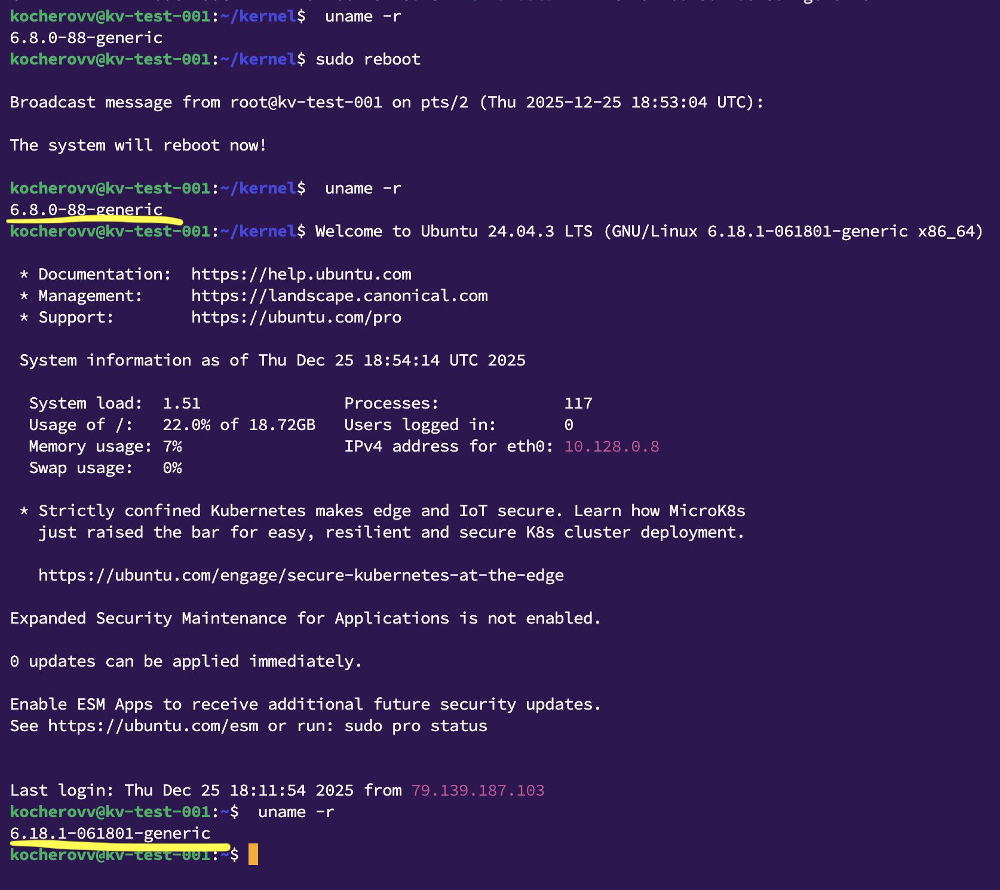

*Обновление ядра системы*

Цель:
научиться обновлять ядро в ОС Linux;

🎯Задание

Запустите ВМ c Ubuntu.  
Обновите ядро ОС на новейшую стабильную версию из mainline-репозитория.  
Оформите отчет в README-файле в GitHub-репозитории.

⭐️Задание со звездочкой

Собрать ядро самостоятельно из исходных кодов. (пропущено)

*Решение:*

1. Создана ВМ в Яндекс Облако на Ubuntu 24.04:  
   (адрес динамический, ВМ прерываемая, актуальные креды должны быть предоставлены мной в переписке)  
    ip: 84.252.129.233  
    login: kocherov

2. Проверяю текущую версию ядра: uname -r
   6.8.0-88-generic

3. Захожу на официальный сайт и выбираю свежую версию для установки, останавливаюсь на:
   https://kernel.ubuntu.com/mainline/v6.18.1/

4. Создаю отдельную директорию для файлов новой версии ядра и загружаю: 
   * mkdir kernel && cd kernel
   * sudo wget https://kernel.ubuntu.com/mainline/v6.18.1/amd64/linux-headers-6.18.1-061801-generic_6.18.1-061801.202512121839_amd64.deb
   * sudo wget https://kernel.ubuntu.com/mainline/v6.18.1/amd64/linux-headers-6.18.1-061801_6.18.1-061801.202512121839_all.deb
   * sudo wget https://kernel.ubuntu.com/mainline/v6.18.1/amd64/linux-image-unsigned-6.18.1-061801-generic_6.18.1-061801.202512121839_amd64.deb
   * sudo wget https://kernel.ubuntu.com/mainline/v6.18.1/amd64/linux-modules-6.18.1-061801-generic_6.18.1-061801.202512121839_amd64.deb

5. Выполняю обновление пакетов sudo apt update && sudo apt upgrade

6. На всякий случай делаю обновление конфигурации загрузчика и загрузку нового ядра по-умолчанию:
   * sudo update-grub
   * sudo grub-set-default 0 

7. После чего делаю ребут сервера:
   * sudo reboot

8. Выполняю повторную проверку версии ядра:  
   uname -r  
   Вижу в выводе новую версию, обновление прошло успешно  
   6.18.1-061801-generic

