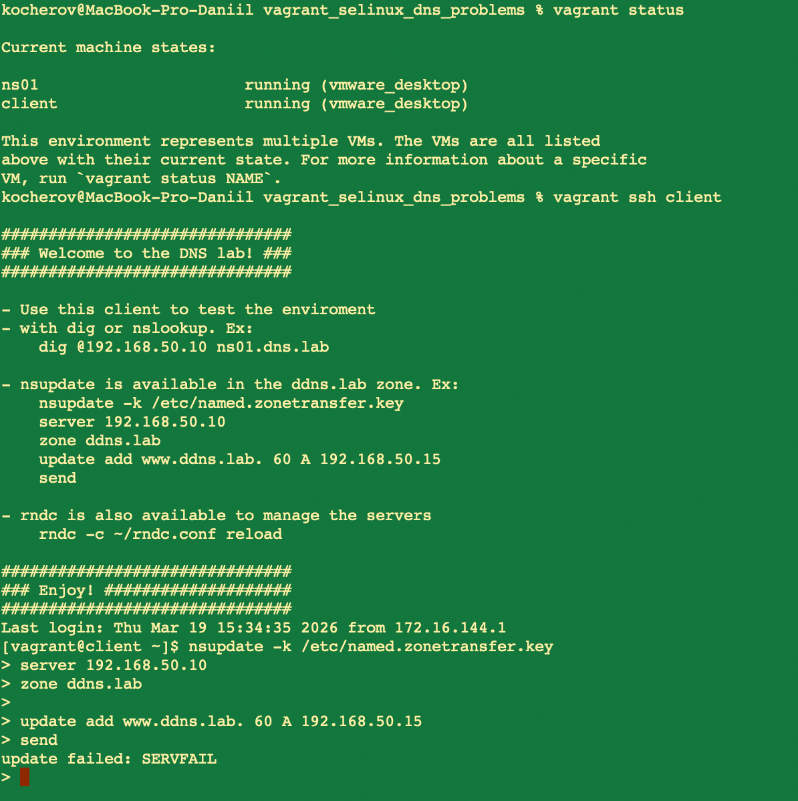
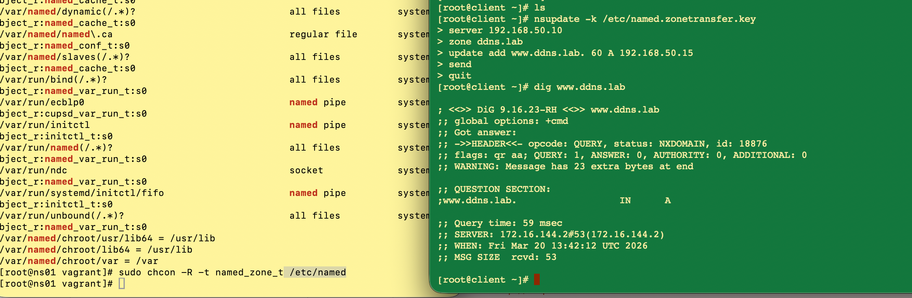

*Домашнее задание: SELinsux*

Цель домашнего задания  
Диагностировать проблемы и модифицировать политики SELinux для корректной работы приложений, если это требуется.  
  
Описание домашнего задания  
  
1. Запустить Nginx на нестандартном порту 3-мя разными способами:  
   переключатели setsebool;  
   добавление нестандартного порта в имеющийся тип;  
   формирование и установка модуля SELinux.  
   К сдаче:  
   README с описанием каждого решения (скриншоты и демонстрация приветствуются).  

2. Обеспечить работоспособность приложения при включенном selinux.  
   развернуть приложенный стенд https://github.com/Nickmob/vagrant_selinux_dns_problems;  
   выяснить причину неработоспособности механизма обновления зоны (см. README);  
   предложить решение (или решения) для данной проблемы;  
   выбрать одно из решений для реализации, предварительно обосновав выбор;  
   реализовать выбранное решение и продемонстрировать его работоспособность.  

*Решение:*

Задача 1  
1. Настроил сервер с Almalinux 9, поставил nginx и инструменты для SELinux
2. Перенастроил nginx.conf на прослушивание порта 4881, убедился что SELinux выдает ошибку прав доступа
3. Обошел ограничение с помощью параметра nis_enabled  
  
4. Обошел ограничение путем прописывания дополнительного разрешенного порта  

5. Обошел ограничение путем генерации модуля по выводу в аудит логах  
  

Задача 2  
1. Развернул стенд, немного изменив vagrant скрипт под MacOS (Использовал VMware вместо VB)
2. Убедился что изменения в ns завершаются ошибкой
  
3. Из методички выяснил, где смотреть разрешения на директории и применил на папку конфигурациями ns01 нужную политику - ошибка ушла
