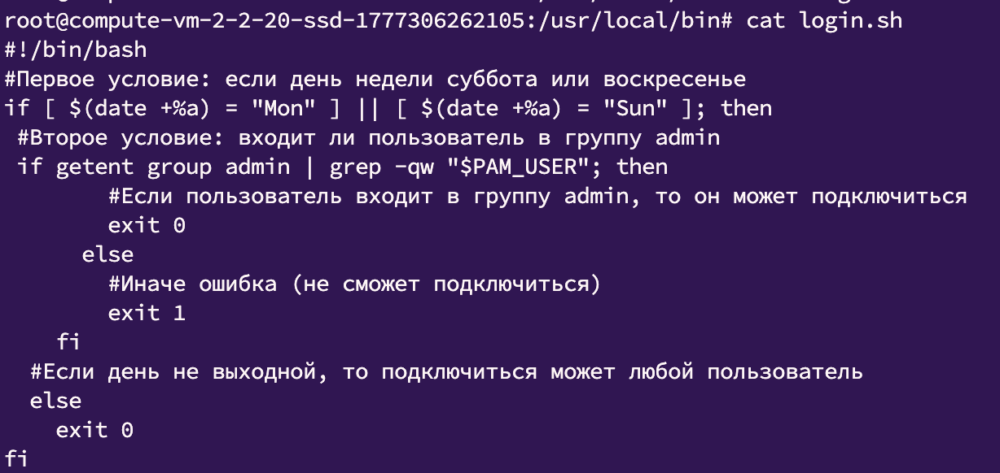
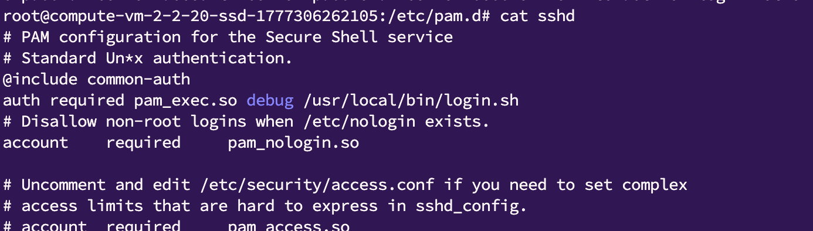

**Цель домашнего задания**  
Научиться создавать пользователей и добавлять им ограничения  
  
**Описание домашнего задания**  
Ограничить доступ к системе для всех пользователей, кроме группы администраторов, в выходные дни (суббота и воскресенье), за исключением праздничных дней.
  
⭐️ **Задание со звездочкой**  
Предоставить определённому пользователю доступ к Docker и право перезапускать Docker-сервис.  

Решение:

1. Создал группу пользователей и скрипт согласно методичке, так как делал в ЯО предварительно включил авторизацию по паролю
2. Скрипт для теста поменял, так как тестил в понедельник а не в выходные

3. Добавил запуск скрипта в PAM конфиг

4. Протестировал, работает как ожидается

⭐️Просто добавить пользователя в группу docker не достаточно?