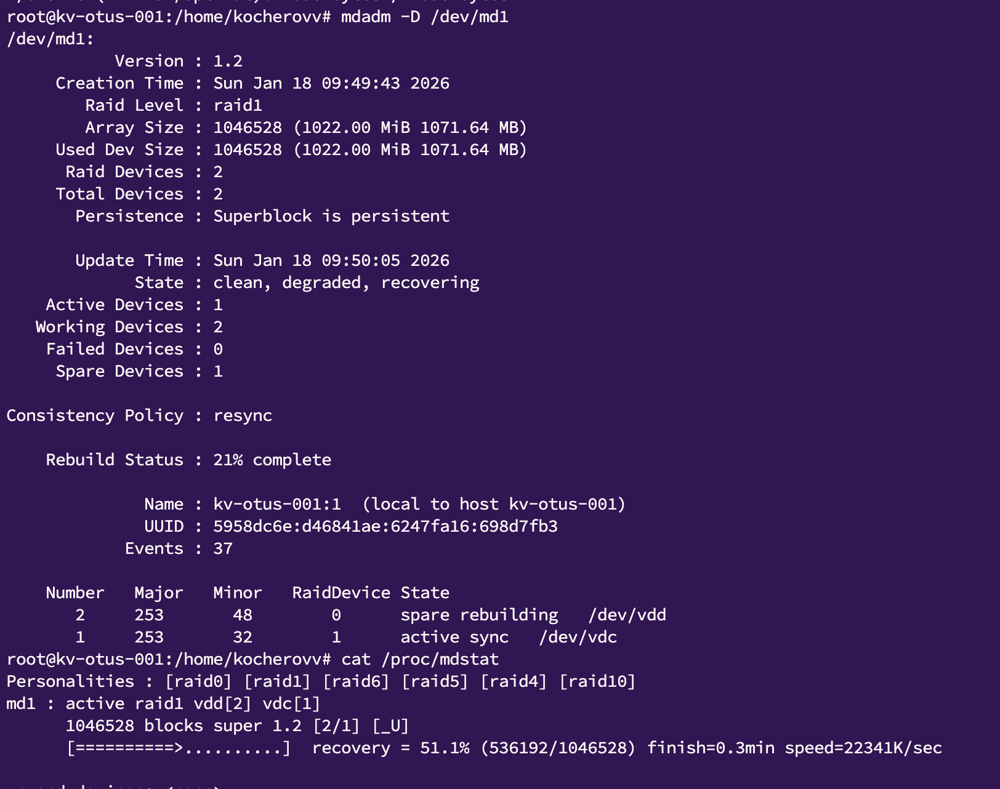
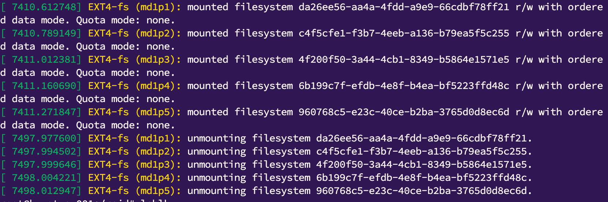

*Домашнее задание: работа с mdadm*  

Задание  
• Добавить в виртуальную машину несколько дисков  
• Собрать RAID-0/1/5/10 на выбор  
• Сломать и починить RAID  
• Создать GPT таблицу, пять разделов и смонтировать их в системе.  
  
На проверку отправьте:  
скрипт для создания рейда,  
отчет по командам для починки RAID и созданию разделов.

*Решение:*

1. Написал плейбук на основе лекции который: создает рейд на базе имеющихся дисков, фэилит и убирает из рейда один из дисков, после чего возвращает его на прежнее место (протестировано на рейд1)  
  
  
2.После ресинка, добавил 5 разделов на диск, создал файловую систему и примантировал раздели в папки каталога /raid/

  
  