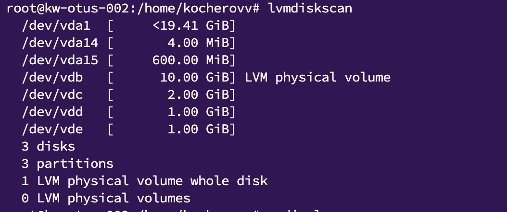
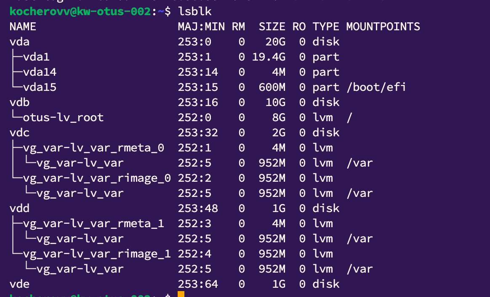

*Домашнее задание: работа с LVM*  

На виртуальной машине с Ubuntu 24.04 и LVM.  
  
1. Уменьшить том под / до 8G.  
2. Выделить том под /home.  
3. Выделить том под /var - сделать в mirror.  
4. /home - сделать том для снапшотов.  
5. Прописать монтирование в fstab. Попробовать с разными опциями и разными файловыми системами (на выбор).  
6. Работа со снапшотами:  
   сгенерить файлы в /home/;  
   снять снапшот;  
   удалить часть файлов;  
   восстановится со снапшота.  
  
* На дисках попробовать поставить btrfs/zfs — с кэшем, снапшотами и разметить там каталог /opt.
  Логировать работу можно с помощью утилиты script.

*Решение:*

1. У меня есть тестовый сервер со следующим набором дисков:  
[img.png](img.png)  
  
2. После предыдущих тестов на нем уже есть 1 физический том и группа томов otus в которую полностью входит vdb:  
  
  
  
3. Создал логический том на vdb размером 8 гигов, примонтировал в /mnt и перенес туда все данные с оригинального рута
Сконфигурировал grub, чтобы при старте перейти в новую рут директорию.  
За одно перенес каталог var и создал зеркало согласно методичке  

  
4. Теперь создам на оригинальном разделе vda1 логическую группу и том для / размером 8ГБ  
Произведу обратную манипуляцию с загрузчиком, чтобы при старте переходить в новый логический том на старом разделе.  
Так как для выполнения задания используется виртуальном сервере Яндекса, пропускаю этот шаг

5. Создаю еще 1 логический том для /home размером 1G. Переношу директорию home на новый том с помощью инструкции в fstab  
  
  
6. Для тестирования снапшотов, создал согласно инструкциям 20 файлов в новой директории /home, сделал снапшот и удалил 10 из них,  
после чего убрал монтирование в fstab и выполнил мерж.  
После повторного монтирования и проверки файлов, вижу что файлы восстановились.
  
  
7. Написал плейбук на основе задания
