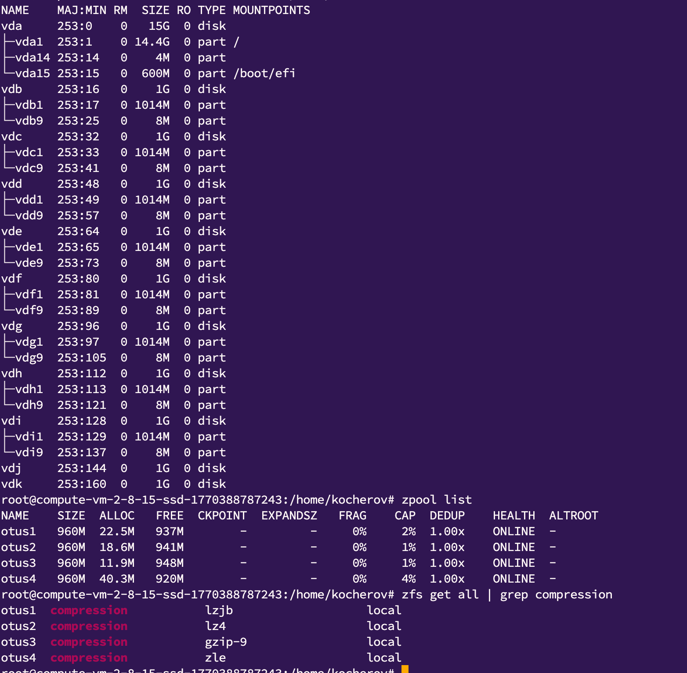
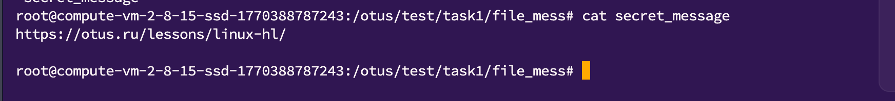

*Домашнее задание: работа с ZFS*  

На виртуальной машине с Ubuntu 24.04 и LVM.  

Определить алгоритм с наилучшим сжатием:  
Определить какие алгоритмы сжатия поддерживает zfs (gzip, zle, lzjb, lz4);  
создать 4 файловых системы на каждой применить свой алгоритм сжатия;  
для сжатия использовать либо текстовый файл, либо группу файлов.  
Определить настройки пула.  
С помощью команды zfs import собрать pool ZFS.  
  
Командами zfs определить настройки:  
- размер хранилища;  
- тип pool;  
- значение recordsize;  
- какое сжатие используется;  
- какая контрольная сумма используется.  
  
Работа со снапшотами:  
скопировать файл из удаленной директории;  
восстановить файл локально. zfs receive;  
найти зашифрованное сообщение в файле secret_message.  
  
*Решение:*  
  
1. Настроил сервер с 10 дисками, обновил пакеты, поставил утилиты (sudo apt install zfsutils-linux)  
2. Изучил алгоритмы сжатия  
  
   | Алгоритм   | Сжатие        | Скорость          | CPU           | Для чего            |
   | ---------- | ------------- | ----------------- | ------------- | ------------------- |
   | **lz4**    | среднее       | cамый быстрый     | минимальный   | дефолт почти всегда |
   | **lzjb**   | слабое        | быстро            | низкий        | устаревший          |
   | **gzip-1** | хорошее       | медленно          | высокий       | холодные данные     |
   | **gzip-9** | максимальное  | самый медленный   | очень высокий | архивы              |
   | **zle**    | специфическое | быстро            | минимальный   | нули                |
  
2. Cоздал 4 zpool на базе двух дисков, объединил в зеркала, настроил сжатие и записал в каждый тестовый файл
  
  
3. Изучил способы получения настроек пулов командами:  
zpool get all {{zpool}}  
zfs get all {{zpool}}  
zfs get available {{zpool}}  
zfs get readonly {{zpool}}  
zfs get recordsize {{zpool}}  
zfs get compression {{zpool}}  
zfs get checksum {{zpool}}  

4. Попробовал восстановить из снапшота данные в одном из пулов по методичке  
   zfs receive otus/test@today < otus_task2.file  
Так же попробовал сам создать файл снапшота, аналогичный скаченному, удалить данные и потом повторно восстановить  
   zfs snapshot <dataset>@<snapshot_name>  
   zfs snapshot otus/test@today  
   zfs send otus/test@today > otus_task2.file 

