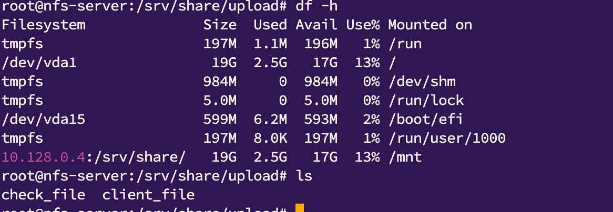
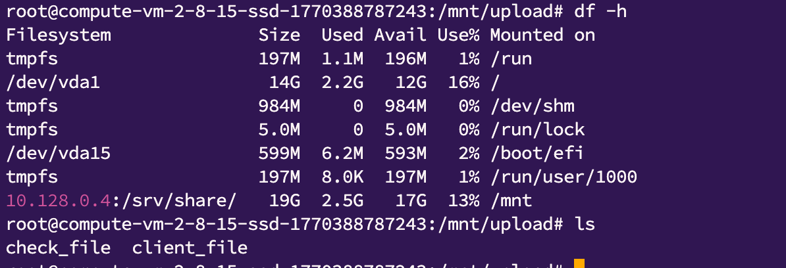

*Домашнее задание: работа с NFS*  

Цель домашнего задания  
Научиться самостоятельно разворачивать сервис NFS и подключать к нему клиентов.  
Описание домашнего задания  
  
Основная часть:  
запустить 2 виртуальных машины (сервер NFS и клиента);  
на сервере NFS должна быть подготовлена и экспортирована директория;  
в экспортированной директории должна быть поддиректория с именем upload с правами на запись в неё;  
экспортированная директория должна автоматически монтироваться на клиенте при старте виртуальной машины (systemd, autofs или fstab — любым способом);  
монтирование и работа NFS на клиенте должна быть организована с использованием NFSv3.  
  
Для самостоятельной реализации:  
настроить аутентификацию через KERBEROS с использованием NFSv4.  
  
*Решение:*  
  
1. Настроил 2 сервера, для nfs сервера и клиента
2. Проверил работу 

