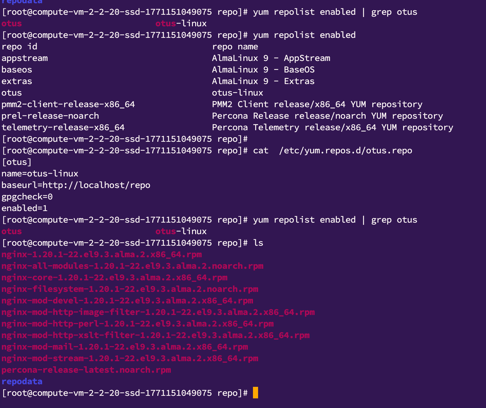
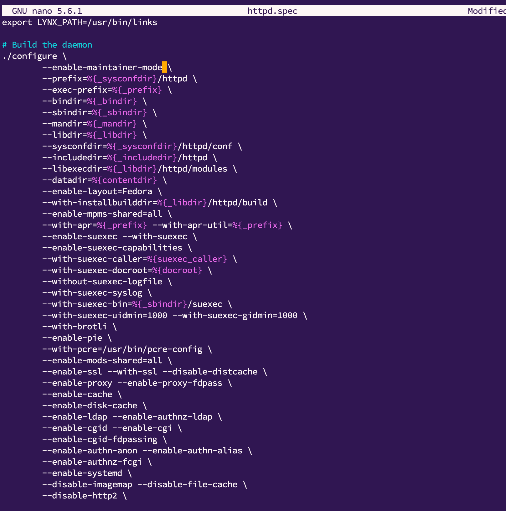

*Домашнее задание: Сборка RPM-пакета и создание репозитория*  
  
Цель:  
Научиться собирать RPM-пакеты.  
Создавать собственный RPM-репозиторий.  

*Что нужно сделать?*  
  
создать свой RPM (можно взять свое приложение, либо собрать к примеру Apache с определенными опциями);  
cоздать свой репозиторий и разместить там ранее собранный RPM;  
реализовать это все либо в Vagrant, либо развернуть у себя через Nginx и дать ссылку на репозиторий.  

*Решение:*  
  
1. Настроил сервер на базе AlmaLinux9.  
2. Попробовал повторить команды для сборки кастомного nginx пакета с дополнительным модулем, настроил веб сервер nginx отдавать статику  
согласно методичке:    
  
  
  
3. Далее согласно указанию собираю Apache с кастомным параметром самостоятельно:  
   yumdownloader --source httpd  
   rpm -Uvh httpd*.src.rpm  
   dnf config-manager --set-enabled crb (не все зависимости есть в дефолтном репо)
   yum-builddep httpd
   cd
   cd rpmbuild/SPECS/  
    
4. Редактирую спек файл, для эксперимента просто добавим --enable-maintainer-mode  
(согласно докам это безобидно - https://httpd.apache.org/docs/current/programs/configure.html)  
  

  
5. Запускаю сборку  
   rpmbuild -ba httpd.spec -D 'debug_package %{nil}'
   cp ~/rpmbuild/RPMS/noarch/* ~/rpmbuild/RPMS/x86_64/

   обновляем статику на сервере:
   cp ~/rpmbuild/RPMS/x86_64/*.rpm /usr/share/nginx/html/repo/
   nginx -t
   nginx -s reload
   

