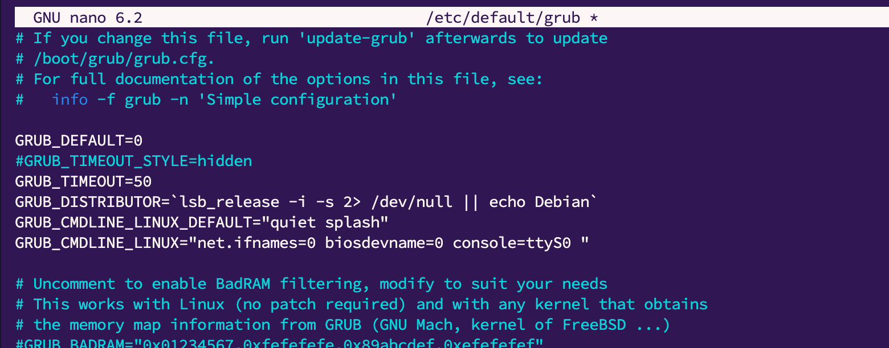

*Домашнее задание: Работа с загрузчиком*  

Цель домашнего задания  
научиться попадать в систему без пароля;  
устанавливать систему с LVM и переименовывать в VG;  
  
Описание домашнего задания  
  
Включить отображение меню Grub.  
Попасть в систему без пароля несколькими способами.  
Установить систему с LVM, после чего переименовать VG.  
  
*Решение:*  
  
1. Настроил сервер с убунту 22.04  
2. Включил отображение граб меню  
  
  
  
Применил изменения update-grub

3. Зашел в баш оболочку до полной загрузки системы, чтобы избежать проверки пароля:
При перезагрузке в меню нажал е
Добавил init=/bin/bash в параметрах запуска и сtrl-x  
После запускла выполнил перемонтирование согласно методичке mount -o remount,rw /  
Убедился что команды работают и есть доступ к файлам  

4. Перезапустил систему, воспользовался входом через Recovery mode:
Выбрал в меню загрузчика Advanced options -> network -> root
Убедился что есть доступ к файлам  
  
5. Далее требуется провести тест с LVM, для этого установил ubuntu 22.04 на диск с разметкой lvm:
Переименовал группу тома в ubuntu-otus и заменил название в конфиге загрузчика  
   sudo sed -i 's/ubuntu--vg/ubuntu--otus/g' /boot/grub/grub.cfg  
После этого делаю перезагрузку и запускаюсь с логического тома

