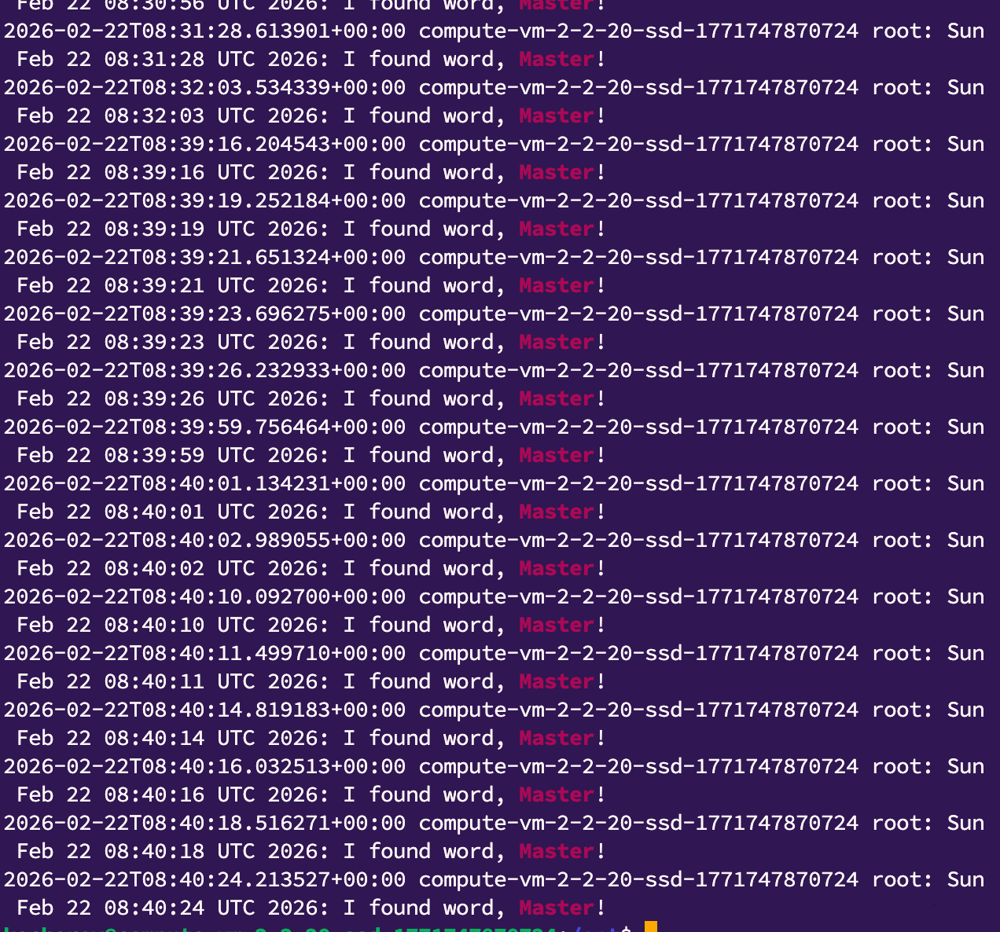
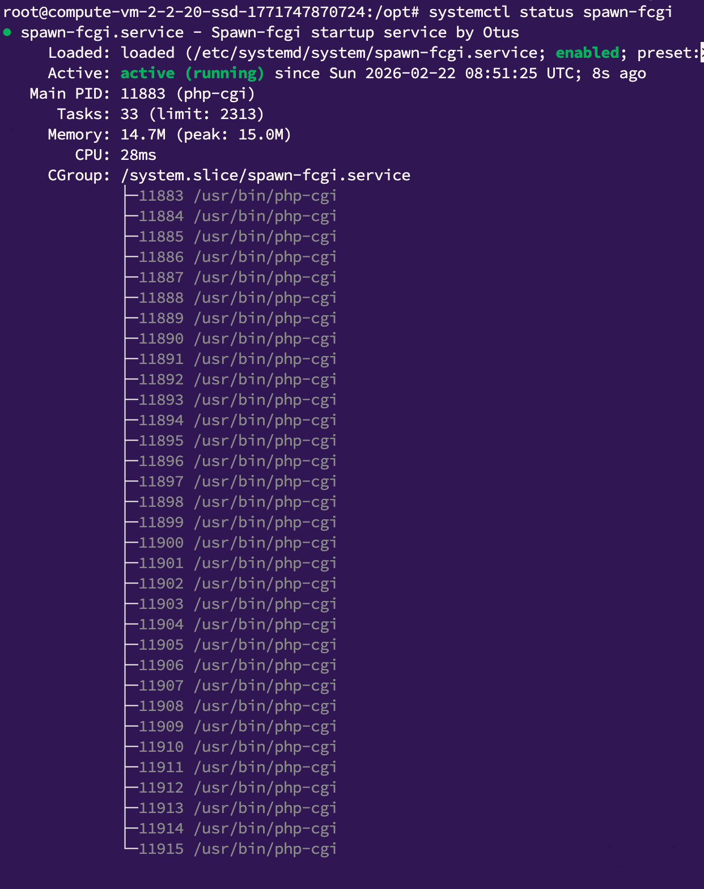
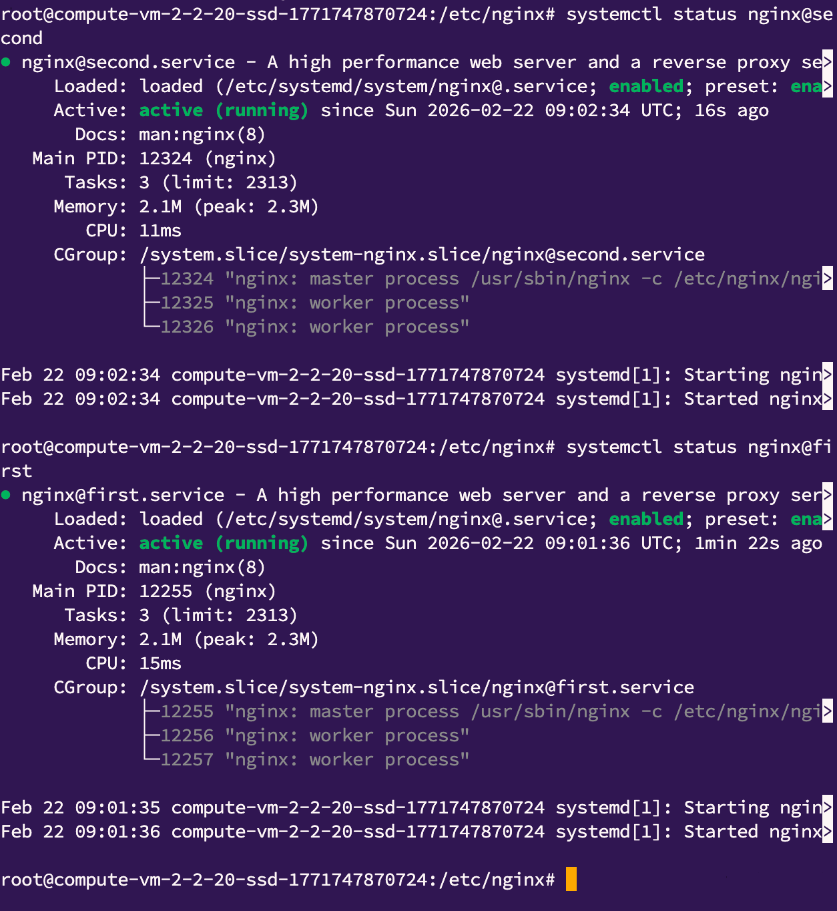

*Домашнее задание: Systemd — создание unit-файла*  

Цель домашнего задания  
научиться работать с сервисами в Systemd — создание unit-файла;
  
Описание домашнего задания  

1. Написать service, который будет раз в 30 секунд мониторить лог на предмет наличия ключевого слова (файл лога и ключевое слово должны задаваться в /etc/default).  
2. Установить spawn-fcgi и создать unit-файл (spawn-fcgi.sevice) с помощью переделки init-скрипта (https://gist.github.com/cea2k/1318020).  
3. Доработать unit-файл Nginx (nginx.service) для запуска нескольких инстансов сервера с разными конфигурационными файлами одновременно.  
  
*Решение:*  
  
1. Настроил 2 юнита согласно методичке, проверка лог файла просиходит раз в секунду (специально сделал чаще для теста)  
  
2. Настроить сервис согласно второму пункту задачи, переопределив параметры запуска скрипта  
  
3. Настроил 2 nginx сервиса на одном хосте, согласно требованиям, разделил файлы конфигураций и пид файлы  
  

