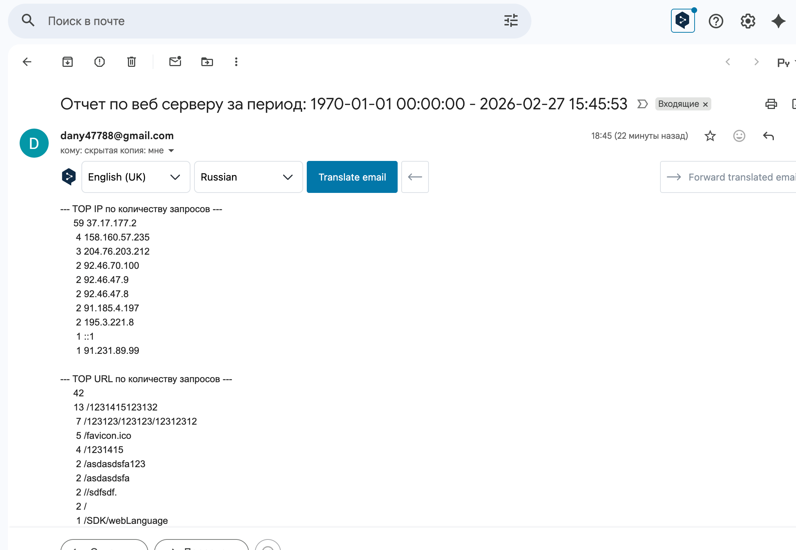

1. Для работы скрипта нужно установить утилиту msmtp  
2. Выпустить пароль для приложений в гугл почте и указать его в /etc/msmtprc  
```text
defaults
auth           on
tls            on
tls_trust_file /etc/ssl/certs/ca-certificates.crt
logfile        /var/log/msmtp.log

account        gmail
host           smtp.gmail.com
port           587
from           fake@gmail.com
user           fake@gmail.com
password       fakepass

account default : gmail
```  
3. Заменить переменную MAIL_TO="fake@gmail.com" на своего получателя
4. Разместить запуск скрипта в кронтабе на сервере с nginx, запускать с правами рута  
    